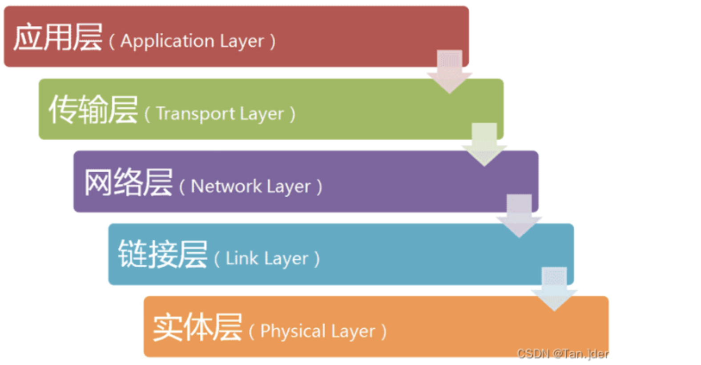

# 计算机网络
## 基础知识
### 网络，互联网
网络 : 多个计算机之间的互联
互联网：多个网络之间互联，网络连接的网络

### 路由器
路由器是分组交换的关键构建，核心的任务实现信息的分组转发【存储转发】
将整块数据报文进行分组后进行转发。
步骤概要
1. 对于整块的报文进行等分分割
2. 每个被分割后的报文前添加控制信息组成首部--形成数据包
3. 数据包一包包含了目的地，原地址信息。

### 网络中常用的性能指标
* 速率
一秒中可传输的bit数据量，即就是二进制数据的位数：额定的速率【理论值】
* 带宽
单位时间内信道可通过的最大数据量
* 吞吐量
但我时间内通过网络的实际数据量
* 时延

* 信道利用率

### TCP 三次握手🤝，四次挥手👋🏻

### 网络协议的五层模型

1. 物理层

2. 数据链路层
3. 网络层
4. 传输层
5. 应用层

