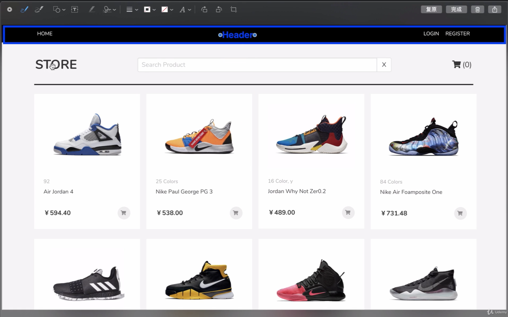

# Getting Started with Create React App

This project was bootstrapped with [Create React App](https://github.com/facebook/create-react-app).

## Available Scripts

In the project directory, you can run:

### `npm start`

Runs the app in the development mode.\
Open [http://localhost:3000](http://localhost:3000) to view it in your browser.

The page will reload when you make changes.\
You may also see any lint errors in the console.

### `npm test`

Launches the test runner in the interactive watch mode.\
See the section about [running tests](https://facebook.github.io/create-react-app/docs/running-tests) for more information.

### `npm run build`

Builds the app for production to the `build` folder.\
It correctly bundles React in production mode and optimizes the build for the best performance.

The build is minified and the filenames include the hashes.\
Your app is ready to be deployed!

See the section about [deployment](https://facebook.github.io/create-react-app/docs/deployment) for more information.

### `npm run eject`

**Note: this is a one-way operation. Once you `eject`, you can't go back!**

If you aren't satisfied with the build tool and configuration choices, you can `eject` at any time. This command will remove the single build dependency from your project.

Instead, it will copy all the configuration files and the transitive dependencies (webpack, Babel, ESLint, etc) right into your project so you have full control over them. All of the commands except `eject` will still work, but they will point to the copied scripts so you can tweak them. At this point you're on your own.

You don't have to ever use `eject`. The curated feature set is suitable for small and middle deployments, and you shouldn't feel obligated to use this feature. However we understand that this tool wouldn't be useful if you couldn't customize it when you are ready for it.

## Learn More

You can learn more in the [Create React App documentation](https://facebook.github.io/create-react-app/docs/getting-started).

To learn React, check out the [React documentation](https://reactjs.org/).

### Code Splitting

This section has moved here: [https://facebook.github.io/create-react-app/docs/code-splitting](https://facebook.github.io/create-react-app/docs/code-splitting)

### Analyzing the Bundle Size

This section has moved here: [https://facebook.github.io/create-react-app/docs/analyzing-the-bundle-size](https://facebook.github.io/create-react-app/docs/analyzing-the-bundle-size)

### Making a Progressive Web App

This section has moved here: [https://facebook.github.io/create-react-app/docs/making-a-progressive-web-app](https://facebook.github.io/create-react-app/docs/making-a-progressive-web-app)

### Advanced Configuration

This section has moved here: [https://facebook.github.io/create-react-app/docs/advanced-configuration](https://facebook.github.io/create-react-app/docs/advanced-configuration)

### Deployment

This section has moved here: [https://facebook.github.io/create-react-app/docs/deployment](https://facebook.github.io/create-react-app/docs/deployment)

### `npm run build` fails to minify

This section has moved here: [https://facebook.github.io/create-react-app/docs/troubleshooting#npm-run-build-fails-to-minify](https://facebook.github.io/create-react-app/docs/troubleshooting#npm-run-build-fails-to-minify)


# react-app

## overview
React 时一个javascript库，用于构建前端UI.
React 是mvc 中的【Mode view Controller】
## init-project-tree
.
├── README.md           
├── package-lock.json--指定项目中依赖的版本
├── package.json -- 项目中的依赖
├── public--静态资源，无需编译可直接调用使用
│   ├── favicon.ico
│   ├── index.html--项目中的首页
│   ├── logo192.png
│   ├── logo512.png
│   ├── manifest.json
│   └── robots.txt
└── src-项目源码的定义的根目录
    ├── App.css
    ├── App.js
    ├── App.test.js
    ├── index.css
    ├── index.js--项目的首页组件，用于将组件绑定到首页指定的根元素。项目的入口js页面
    ├── logo.svg
    ├── reportWebVitals.js
    └── setupTests.js

## component login
### 集成css framework bulma.io
前端组件库：[Bulma](https://bulma.io/)
`npm install bulma`
### 编辑login组件
### 集成sass 
```
npm install node-sass --save-dev
npm install bulma --save-dev
```


## 商品首页
### 页面组件化
#### 页面组成:


1. header 与 productList
2. productList 由 product 构成

### 组件定义demo
* App.js
```
import React from "react";
import { Header } from "./Header";
import { Products } from "./Products";


export const App = () => {

    return (
     <div className="container">
        <Header></Header>
        <Products></Products>
     </div>
    );
};


```

* Header.js
```
import React from "react";

export const Header = () => {

    return (
     <div className="container">
        hello header;
     </div>
    );
};

```
* Products.js
```
import React from "react";

export const Products = () => {

    return (
     <div className="container">
        hello Products;
     </div>
    );
};
```

### react 配置绝对路径
[SET ABSOLUTE PATH](https://create-react-app.dev/docs/importing-a-component#absolute-imports)

## 组件的传参
### FC COMPONENT
使用关键字props,js内置的属性对象
```export const Header = (props) => {
  return (
    <div className="header">
      <div className="home">HOME</div>
      <div className="login-register">
       <label>LOGIN</label>
       <label>{props.name}</label>
      </div>
    </div>
  );
};
```
```<Header name="zhangsan"></Header>```
  
### 条件渲染
在react 中可以创建不同在组件，从而在不同的条件下进行组件的渲染
```
qqqqqq

```
   