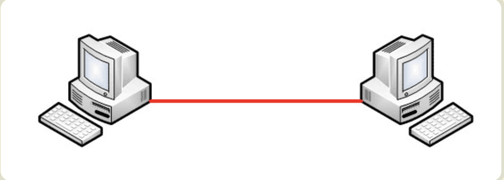
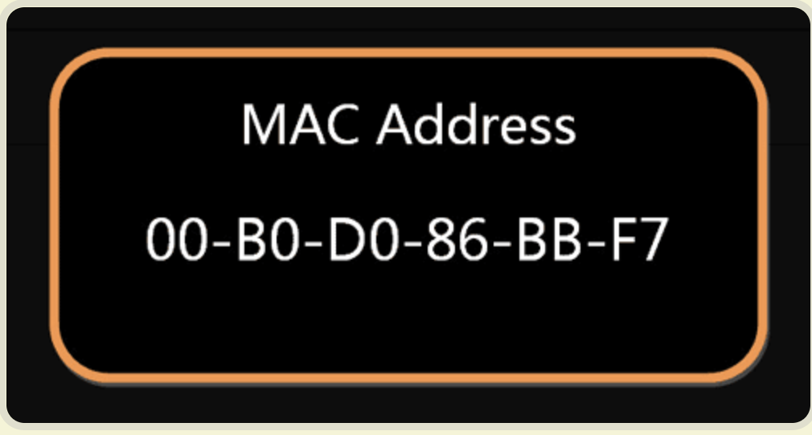
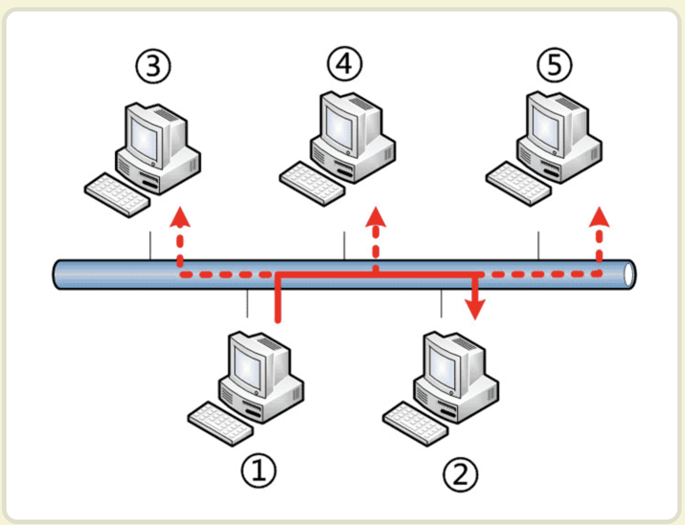

# 计算机网络
## 基础知识
### 网络，互联网
网络 : 多个计算机之间的互联
互联网：多个网络之间互联，网络连接的网络

### 路由器
路由器是分组交换的关键构建，核心的任务实现信息的分组转发【存储转发】
将整块数据报文进行分组后进行转发。
步骤概要
1. 对于整块的报文进行等分分割
2. 每个被分割后的报文前添加控制信息组成首部--形成数据包
3. 数据包一包包含了目的地，原地址信息。

### 网络中常用的性能指标
* 速率
一秒中可传输的bit数据量，即就是二进制数据的位数：额定的速率【理论值】
* 带宽
单位时间内信道可通过的最大数据量
* 吞吐量
但我时间内通过网络的实际数据量
* 时延

* 信道利用率

### TCP 三次握手🤝，四次挥手👋🏻

### 网络协议的五层模型

上述每一次完成一定的功能，为实现特定的功能，设定具体的通信规则【protocol】
#### 物理层

将单个的电脑用具体的物理手段进行连接
连接手段
* 网线
* 光缆
* 无线电波

##### 作用 
传输0，1电信号

#### 数据链路层
数据链路层位于物理层正上方，其用于解读电信号0,1.但单纯的0,1 没有任何的有效意义。因此需要固定的信号解析方式--确定的0,1 分组方式
##### 以太网协议
早期，每个公司都有其自己的电信号的分组方式。逐渐的形成统一的“以太网”协议。其特征规定
一组电信号称为数据帧，每一个帧分为header,data两部分组成

###### header: 
包含发送者，接受者，数据类型等信息，长度为18个字节
###### data:
数据的长度：46~1500字节
因此，整个数据帧的长度为：Header + Data [64~1518] 字节

##### MAC 地址
使用以太网进行数据帧的传输中，如何在识别header 不得发送者，接收者的信息
以太网规定，连入网络的设备，必须具有"网卡"接口，数据包的传输必须是从一个网卡传输到指定的网卡--MAC 地址

###### 备注
MAC 地址，每一台设备都是独一无二的。长度为48个二进制位，通常使用12个16进制的数据表示

前六位是厂商编号，后六位是网卡的流水号,有了明确的mac地址，即可有效的定位数据包与网卡的地址了

##### 广播
有了接收者的mac地址,数据是如何进行寻址传播,以太网协议使用“广播”的方式进行数据包的传播，即就是其不是采用精准的寻址，而后向目标地址发送数据包，而是采用广播的形式，向其网域内所有的计算机
发送消息，网域内的计算机会对消息端的header 的mac地址进行判断。若mac 地址为自己的网卡地址，则接收数据包，否则进行拒绝

上图中标号为1的电脑进行数据包的发送，标号2,3,4,5 的计算机均收到该消息。而后对于消息中的mac地址与自己的mac地址进行比较。如图，标号2 的计算机mac地址与数据包中的目的mac一致，则2号计算机接收消息。其他电脑拒绝消息。

2. 网络层
3. 传输层
4. 应用层

